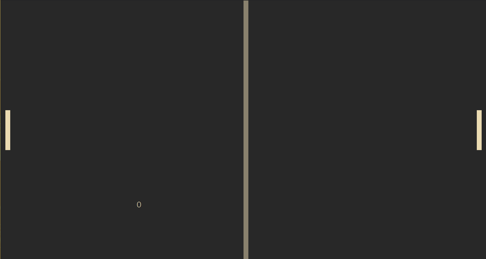

# ygttt

a simple pong  game written in fortran 2003 using ncurses



## build
first clone the repository

```
git clone https://github.com/yeti0904/ygpong --recurse-submodules
```

then build M_ncurses

```
cd M_ncurses/src
make F90=gfortran gfortran
```

then build ygpong

```
cd ../..
make
```

## controls
arrow keys to control player 1 (left)
W and S to control player 2 (right)
space to select menu items